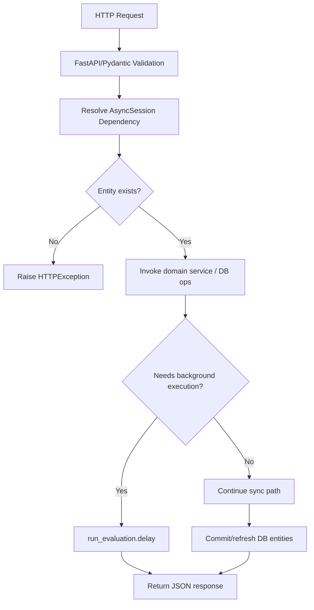
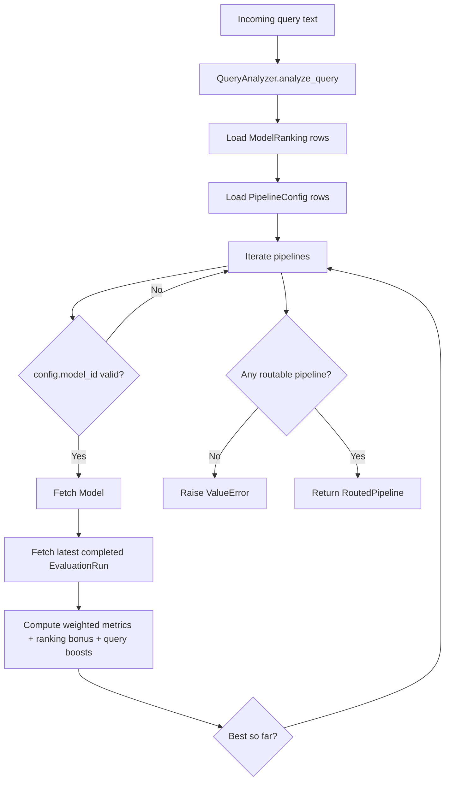
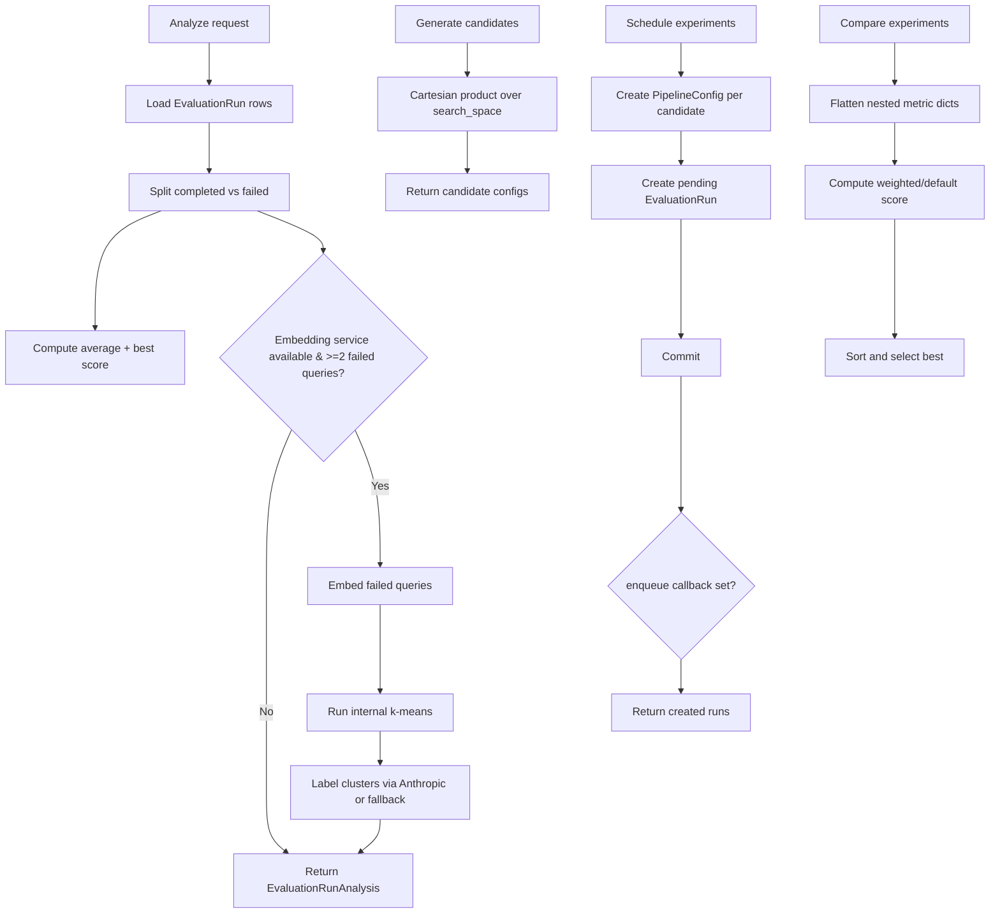

# Component-Level Detailed Flowcharts

## 1) API Routing and Request Orchestration

### Component Name
API Layer (`src/api/routes.py`)

### Purpose
Expose HTTP endpoints for dataset management, run lifecycle, optimization workflows, benchmarking, model ranking, and routing stats.

### Key Files / Paths
- `src/main.py`
- `src/api/routes.py`
- `src/core/database.py`

### Inputs
- JSON request payloads and path/query params.
- Async DB session dependency (`get_db`).

### Outputs
- JSON responses.
- Persisted DB records (datasets, runs, chunks, decisions, rankings, etc.).
- Enqueued Celery jobs.

### Dependencies
- Domain services (`EvaluationService`, `OptimizationService`, `ModelBenchmarkService`, etc.).
- `run_evaluation` Celery task.
- SQLAlchemy async session.

### Internal Processing Steps
1. Parse and validate request payloads through Pydantic models.
2. Query DB for referenced entities (dataset/run existence checks).
3. Instantiate required services.
4. Execute service methods and translate outputs to response models.
5. Commit DB changes and return response.

### Validation / Error Handling
- 404 errors for missing dataset/run.
- 400 error for empty model list in benchmark endpoint.
- Service-level exceptions are mostly propagated unless explicitly handled.

### Notes / Limitations
- Router is mounted both root and `/api/v1`.
- Some route paths already include `/api/v1`, resulting in duplicated prefixed variants.



---

## 2) Evaluation Pipeline

### Component Name
`EvaluationService`

### Purpose
Run a single RAG evaluation for one question/answer pair, combining retrieval quality metrics and LLM judge scores; persist run and experiment records.

### Key Files / Paths
- `src/services/evaluation_service.py`
- `src/evaluation/retrieval_metrics.py`
- `src/models/evaluation.py`

### Inputs
- `evaluation_run_id`, `dataset_id`, `pipeline_config_id`, `question`, `answer`.
- Optional `relevant_chunk_ids` and `routing_enabled` flag.

### Outputs
- `EvaluationResult` object.
- Updated `evaluation_runs` row and inserted `pipeline_experiments` row.

### Dependencies
- `EmbeddingService`
- `RetrievalService`
- `ClaudeJudgeService`
- Optional: `RoutingPolicyService`, `ProviderFactory`

### Internal Processing Steps
1. (Optional) Route query to selected model/pipeline when `routing_enabled=True`.
2. Generate query embedding.
3. Retrieve top-k context chunks from vector store.
4. (Optional) Generate routed answer via selected LLM provider with fallback.
5. Compute retrieval metrics (`precision_at_k`, `recall_at_k`, `reciprocal_rank`).
6. Evaluate answer/context with Claude judge metrics.
7. Compute aggregate score (mean of all metric values).
8. Update evaluation run status/metrics/timestamps.
9. Create pipeline experiment record and commit.

### Validation / Error Handling
- Raises `ValueError` when `EvaluationRun` not found.
- Routed answer generation catches broad exception and uses fallback answer.

### Notes / Limitations
- Score is simple unweighted mean of all retrieval + judge metrics.
- No retry/backoff behavior for external provider calls inside service.

```mermaid
flowchart TD
    Start[Evaluate request] --> Route{routing_enabled?}
    Route -- Yes --> Select[QueryAnalyzer + RoutingPolicyService.select_pipeline]
    Route -- No --> Embed
    Select --> Embed[EmbeddingService.embed_text(question)]
    Embed --> Retrieve[RetrievalService.search(dataset_id, embedding, k, threshold)]
    Retrieve --> Gen{Generate routed answer?}
    Gen -- Yes --> Provider[ProviderFactory -> provider.generate(prompt)]
    Gen -- No --> Metrics
    Provider --> Metrics[compute_retrieval_metrics]
    Metrics --> Judge[ClaudeJudgeService.evaluate]
    Judge --> Score[Compute aggregate score]
    Score --> LoadRun[Load EvaluationRun by id]
    LoadRun --> Persist[Set run completed + create PipelineExperiment + commit]
    Persist --> End[Return EvaluationResult]
```

---

## 3) Background Job Execution

### Component Name
Celery Evaluation Task (`run_evaluation`)

### Purpose
Execute queued evaluation runs asynchronously outside request cycle.

### Key Files / Paths
- `src/tasks/jobs.py`
- `src/core/celery_app.py`
- `src/tasks/worker.py`

### Inputs
- Celery task argument: `evaluation_run_id` string.

### Outputs
- Task return payload of evaluation result dict.
- Persisted run state transitions (`pending` → `running` → `completed`/`failed`).

### Dependencies
- Async SQLAlchemy session factory.
- Service factory building `EvaluationService` with real provider clients.

### Internal Processing Steps
1. Celery task creates a new event loop.
2. Async function loads evaluation run by ID.
3. Marks run as `running` and commits.
4. Loads first QA pair from dataset.
5. Builds evaluation service and calls `evaluate`.
6. On success, returns evaluation payload.
7. On failure, marks run `failed`, stores error in metrics, sets completion timestamp, commits, and re-raises.

### Validation / Error Handling
- Raises `ValueError` if run or QA pair is missing.
- Captures evaluation exceptions to persist failed state before re-raising.

### Notes / Limitations
- Processes only first QA pair (`limit(1)`) per run.

```mermaid
flowchart TD
    Trigger[Celery task run_evaluation] --> Loop[Create event loop]
    Loop --> Async[_run_evaluation_async]
    Async --> LoadRun{Run exists?}
    LoadRun -- No --> FailRunErr[Raise ValueError]
    LoadRun -- Yes --> MarkRunning[Set status=running; commit]
    MarkRunning --> LoadQA{QA pair exists?}
    LoadQA -- No --> FailQAErr[Raise ValueError]
    LoadQA -- Yes --> BuildSvc[Build EvaluationService]
    BuildSvc --> Eval[service.evaluate(...)]
    Eval -->|success| Return[Return result.to_dict]
    Eval -->|exception| MarkFailed[Set status=failed + metrics.error + completed_at; commit; re-raise]
```

---

## 4) Adaptive Routing Policy

### Component Name
`RoutingPolicyService` + `QueryAnalyzer`

### Purpose
Select best pipeline/model for a query using query features, historical evaluation metrics, ranking signals, and model cost/context attributes.

### Key Files / Paths
- `src/services/query_analyzer.py`
- `src/services/routing_policy_service.py`
- `src/models/model_ranking.py`
- `src/models/routing_decision.py`

### Inputs
- `dataset_id`
- Query features (`query_type`, reasoning flag, long-context flag, difficulty estimate)

### Outputs
- `RoutedPipeline` selection (`model_id`, `pipeline_config_id`, `score`, `reason`)
- (API/evaluation callers) persisted routing decision log.

### Dependencies
- `ModelRanking`, `PipelineConfig`, `EvaluationRun`, `Model` tables.

### Internal Processing Steps
1. Analyze raw query into heuristic features.
2. Load dataset model rankings and candidate pipeline configs.
3. For each pipeline with a valid `model_id`:
   - fetch model metadata,
   - fetch latest completed run metrics,
   - compute weighted score: faithfulness/relevance/recall/MRR/cost + ranking bonus,
   - apply query-based boosts (reasoning/long-context).
4. Return highest-scoring routable pipeline.

### Validation / Error Handling
- Raises `ValueError` when no pipeline exists or none are routable.

### Notes / Limitations
- Feature extraction is heuristic keyword/length-based.
- Uses only latest run per pipeline; no explicit temporal smoothing.



---

## 5) Optimization and Experiment Management

### Component Name
`OptimizationService`

### Purpose
Provide run analytics, failure clustering, candidate generation, experiment scheduling, and best-pipeline comparison.

### Key Files / Paths
- `src/services/optimization_service.py`
- `src/models/evaluation.py`

### Inputs
- Optional run filters (`dataset_id`, `pipeline_config_id`).
- Candidate search space configs.
- Existing `PipelineExperiment` rows + optional metric weights.

### Outputs
- `EvaluationRunAnalysis` summaries.
- Failure clusters.
- Candidate config combinations.
- Created `EvaluationRun` records.
- Ranked `PipelineComparison` outputs.

### Dependencies
- DB session + evaluation tables.
- Optional embedding service and Anthropic client for cluster labeling.

### Internal Processing Steps
1. Query evaluation runs by filters.
2. Compute totals and score aggregates from completed runs.
3. (Optional) Build failure clusters:
   - extract failed query text,
   - embed queries,
   - run in-service k-means,
   - optionally label clusters via Anthropic JSON response.
4. Generate candidate configs via cartesian product over search space.
5. Schedule experiment runs by creating `PipelineConfig` + `EvaluationRun` pairs and optional enqueue callback.
6. Flatten experiment metrics and rank/select best pipeline using weighted scoring.

### Validation / Error Handling
- Handles missing metrics robustly (defaults/empty dict behavior).
- If embedding service is absent or too few failures, clustering returns empty list.

### Notes / Limitations
- K-means implementation is lightweight/manual (not sklearn).
- Cluster labels are fallback-generated when Anthropic client is unavailable.



---

## 6) Embedding + Retrieval Subsystem

### Component Name
`EmbeddingService` and `RetrievalService`

### Purpose
Convert text to vectors with cache support and retrieve most similar chunks from pgvector-backed storage.

### Key Files / Paths
- `src/services/embedding_service.py`
- `src/services/retrieval_service.py`

### Inputs
- Text list or single text.
- Dataset ID, query embedding, `k`, and similarity threshold.

### Outputs
- Embedding vectors.
- Retrieved chunk list with similarity scores.

### Dependencies
- OpenAI embeddings API.
- Redis cache.
- PostgreSQL/pgvector query execution.

### Internal Processing Steps
1. For each text, compute cache key (`sha256`) and attempt Redis lookup.
2. Batch API-call only cache misses.
3. Cache new embeddings with TTL and reconstruct output in original order.
4. Build pgvector literal from query embedding.
5. Execute SQL cosine-distance similarity query with dataset filter + threshold + limit.
6. Map DB rows to typed `RetrievalResult` objects.

### Validation / Error Handling
- Empty text list returns empty embedding list.
- Empty embedding or non-positive `k` returns empty retrieval list.
- No explicit retry/circuit-breaker logic around API/DB/cache failures.

### Notes / Limitations
- Embedding dimensionality in model schema is fixed at 1536.
- Retrieval SQL is handwritten text query (not ORM expression).

```mermaid
flowchart TD
    Texts[Input text(s)] --> CacheCheck[Check Redis by emb:model:sha256]
    CacheCheck --> Misses{Any cache misses?}
    Misses -- Yes --> OpenAI[Call OpenAI embeddings.create]
    OpenAI --> CacheWrite[Write misses to Redis setex]
    Misses -- No --> Merge
    CacheWrite --> Merge[Assemble ordered embeddings]
    Merge --> Query[Build query vector literal]
    Query --> SQL[Execute pgvector similarity SQL]
    SQL --> Results[Map rows to RetrievalResult list]
```
