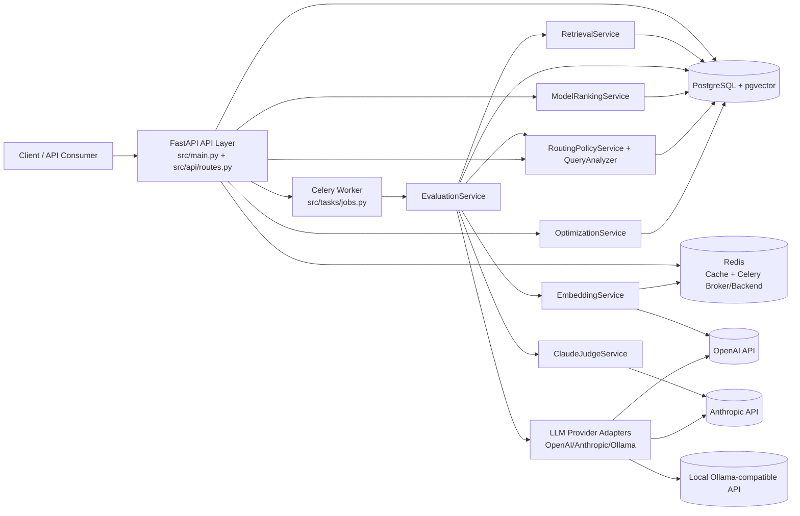

# High-Level Architecture Flowchart

## 1. High-Level System Summary

`ragprobe` is a FastAPI + Celery backend for RAG evaluation. The API writes datasets/pipelines/runs to PostgreSQL, enqueues background evaluation jobs, and exposes analysis/ranking/routing endpoints that operate on stored evaluation outcomes. Embeddings are generated via OpenAI with Redis caching; retrieval uses pgvector search; quality judging uses Anthropic Claude.

## 2. Mermaid High-Level Flowchart

## 3. Component Explanations

- **Client / API Consumer**: External caller invoking endpoints for dataset setup, run execution, analysis, benchmarking, and routing.
- **FastAPI API Layer**: HTTP boundary, request/response models, and service orchestration.
- **PostgreSQL + pgvector**: Source of truth for datasets, chunks, runs, experiments, models, rankings, and routing decisions; also executes vector similarity queries.
- **Redis**: Embedding cache plus Celery broker/result backend.
- **Celery Worker**: Async execution path for queued evaluation runs.
- **EvaluationService**: Core RAG evaluation orchestration.
- **EmbeddingService**: OpenAI embedding generation with hash-based Redis cache.
- **RetrievalService**: Top-k vector retrieval from `knowledge_chunks` with similarity filtering.
- **ClaudeJudgeService**: LLM-as-judge scoring across faithfulness/relevance/hallucination/confidence.
- **RoutingPolicyService + QueryAnalyzer**: Adaptive model/pipeline selection using query features, historical metrics, ranking, and cost/context heuristics.
- **ModelRankingService**: Computes and stores per-dataset model ranks from completed runs.
- **OptimizationService**: Run analysis, failure clustering, candidate generation, experiment scheduling, and pipeline comparison.
- **LLM Provider Adapters**: Unified generation interface across OpenAI, Anthropic, and local/Ollama endpoints.
