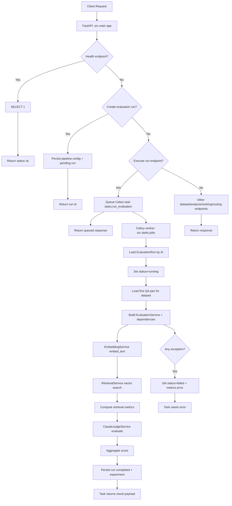

# Runtime Flowchart

This document provides a focused runtime flowchart for request handling and background evaluation execution.

## Notes

- The API and worker are decoupled through Redis-backed Celery queues.
- Evaluation execution is asynchronous and status-driven (`pending` → `running` → `completed`/`failed`).
- Query embedding, retrieval, and judge scoring are the core stages that feed the final run score.
